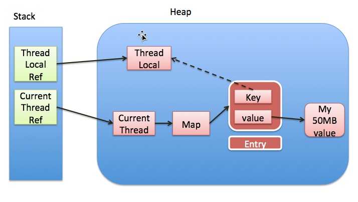

## ThreadLocal定义
>ThreadLocal类用来提供线程内部的局部变量。这种变量在多线程环境下访问(通过get或set方法访问)时能保证各个线程里的变量相对独立于其他线程内的变量。ThreadLocal实例通常来说都是private static类型的，用于关联线程和线程的上下文。
>
>可以总结为一句话：ThreadLocal提供线程内部的局部变量，在本线程内随时随地可取，隔离其他线程。。
---
### ThreadLocal实现

基于jdk1.8每个Thread维护一个ThreadLocalMap哈希表，这个哈希表的key是ThreadLocal实例本身，value才是真正要存储的值Object。

* 实现图


优势
  1. 每个Map存储的Entry数量就会变小，因为之前的存储数量由Thread的数量决定，现在是由ThreadLocal的数量决定
  2. 当Thread销毁之后，对应的ThreadLocalMap也会随之销毁，能减少内存的使用。

### 方法解析

*get()方法*


* 调用get()操作获取ThreadLocal中对应当前线程存储的值时，进行了如下操作：
```
1 ) 获取当前线程Thread对象，进而获取此线程对象中维护的ThreadLocalMap(threadlocals)对象。

2 ) 判断当前的ThreadLocalMap是否存在：
```
* 如果存在，则以当前的ThreadLocal 为 key，调用ThreadLocalMap中的getEntry方法获取对应的存储实体 e。找到对应的存储实体 e，获取存储实体 e 对应的 value值，即为我们想要的当前线程对应此ThreadLocal的值，返回结果值。
* 如果不存在，则证明此线程没有维护的ThreadLocalMap对象，调用setInitialValue方法进行初始化。返回setInitialValue初始化的值。
* setInitialValue方法的操作如下：
```java
1 ) 调用initialValue获取初始化的值。

2 ) 获取当前线程Thread对象，进而获取此线程对象中维护的ThreadLocalMap对象。

3 ) 判断当前的ThreadLocalMap是否存在：
```
* 如果存在，则调用map.set设置此实体entry。
* 如果不存在，则调用createMap进行ThreadLocalMap对象的初始化，并将此实体entry作为第一个值存放至ThreadLocalMap中。

*set()方法*

* 调用set(T value)操作设置ThreadLocal中对应当前线程要存储的值时，进行了如下操作：
```java
1 ) 获取当前线程Thread对象，进而获取此线程对象中维护的ThreadLocalMap对象。

2 ) 判断当前的ThreadLocalMap是否存在：
```
* 如果存在，则调用map.set设置此实体entry。

* 如果不存在，则调用createMap进行ThreadLocalMap对象的初始化，并将此实体entry作为第一个值存放至ThreadLocalMap中。

*remove()方法*

* 调用remove()操作删除ThreadLocal中对应当前线程已存储的值时，进行了如下操作：
```java
1 ) 获取当前线程Thread对象，进而获取此线程对象中维护的ThreadLocalMap对象。

2 ) 判断当前的ThreadLocalMap是否存在， 如果存在，则调用map.remove，以当前ThreadLocal为key删除对应的实体entry。
```
---
源码参考
```java
    /*
    *getMap为空时调用初始化value方法（new ThreadLocal时会override此方法）
    */
    public T get() {
        Thread t = Thread.currentThread();
        ThreadLocalMap map = getMap(t);
        if (map != null) {
            ThreadLocalMap.Entry e = map.getEntry(this);
            if (e != null) {
                @SuppressWarnings("unchecked")
                T result = (T)e.value;
                return result;
            }
        }
        return setInitialValue();
    }

@Transactional
public void A(){
  try {
    save(a);
    B();
  } catch(Exception e) {

  }
}
@Transactional
public void B(){
  save(b);
}


    /*
    *调用初始化方法并设置ThreadLocalMap变量
    */
        private T setInitialValue() {
        T value = initialValue();
        Thread t = Thread.currentThread();
        ThreadLocalMap map = getMap(t);
        if (map != null)
            map.set(this, value);
        else
            createMap(t, value);
        return value;
    }

        void createMap(Thread t, T firstValue) {
        t.threadLocals = new ThreadLocalMap(this, firstValue);
    }

        public void set(T value) {
        Thread t = Thread.currentThread();
        ThreadLocalMap map = getMap(t);
        if (map != null)
            map.set(this, value);
        else
            createMap(t, value);
    }

         public void remove() {
         ThreadLocalMap m = getMap(Thread.currentThread());
         if (m != null)
             m.remove(this);
     }

         ThreadLocalMap getMap(Thread t) {
        return t.threadLocals;
    }
```

## ThreadLocalMap源码分析
      自定义HashMap,Entry用数组存储(初始化大小为16),Entry中存储key(ThreadLocal变量)-value(Threadlocal中保存的局部变量)
* ThreadLocalMap的构造方法是延迟加载的，也就是说，只有当线程需要存储对应的ThreadLocal的值时，才初始化创建一次（仅初始化一次）。初始化步骤如下：
```java
1） 初始化底层数组table的初始容量为 16。

2） 获取ThreadLocal中的threadLocalHashCode，通过threadLocalHashCode & (INITIAL_CAPACITY - 1)，即ThreadLocal 的 hash 值 threadLocalHashCode % 哈希表的长度 length 的方式计算该实体的存储位置。

3） 存储当前的实体，key 为 : 当前ThreadLocal value：真正要存储的值

4）设置当前实际存储元素个数 size 为 1

5）设置阈值setThreshold(INITIAL_CAPACITY)，为初始化容量 16 的 2/3。
```

      getEntryAfterMiss(ThreadLocal<?> key, int i, Entry e)方法操作如下：
```java
1 ) 获取底层哈希表数组table，循环遍历对应要查找的实体Entry所关联的位置。

2 ) 获取当前遍历的entry 的 key ThreadLocal，比较key是否一致，一致则返回。

3 ) 如果key不一致 并且 key 为 null，则证明引用已经不存在，这是因为Entry继承的是WeakReference，这是弱引用带来的坑。调用expungeStaleEntry(int staleSlot)方法删除过期的实体Entry（此方法不单独解释，请查看示例代码，有详细注释说明）。

4 ) key不一致 ，key也不为空，则遍历下一个位置，继续查找。

5 ) 遍历完毕，仍然找不到则返回null。
```
参考代码
```java
        //初始化Entry数组的大小
        private static final int INITIAL_CAPACITY = 16;

        static class Entry extends WeakReference<ThreadLocal<?>> {
            /** The value associated with this ThreadLocal. */
            Object value;

            Entry(ThreadLocal<?> k, Object v) {
                super(k);
                value = v;
            }
        }
        //ThreadLocalMap构造方法
        ThreadLocalMap(ThreadLocal<?> firstKey, Object firstValue) {
            table = new Entry[INITIAL_CAPACITY];
            int i = firstKey.threadLocalHashCode & (INITIAL_CAPACITY - 1);
            table[i] = new Entry(firstKey, firstValue);
            size = 1;
            setThreshold(INITIAL_CAPACITY);
        }
        //ThreadLocal.get()中getMap实际调用
        private Entry getEntry(ThreadLocal<?> key) {
            int i = key.threadLocalHashCode & (table.length - 1);
            Entry e = table[i];
            if (e != null && e.get() == key)
                return e;
            else
                return getEntryAfterMiss(key, i, e);
        }

        /**
         * Version of getEntry method for use when key is not found in
         * its direct hash slot.
         *
         * @param  key the thread local object
         * @param  i the table index for key's hash code
         * @param  e the entry at table[i]
         * @return the entry associated with key, or null if no such
         */
        private Entry getEntryAfterMiss(ThreadLocal<?> key, int i, Entry e) {
            Entry[] tab = table;
            int len = tab.length;

            while (e != null) {
                ThreadLocal<?> k = e.get();
                if (k == key)
                    return e;
                if (k == null)
                    expungeStaleEntry(i);
                else
                    i = nextIndex(i, len);
                e = tab[i];
            }
            return null;
        }
```
# 总结
1. `ThreadLocal`提供线程内部的局部变量，在本线程内随时随地可取，隔离其他线程。

2. `ThreadLocal`的设计是：每个Thread维护一个`ThreadLocalMap`哈希表，这个哈希表的key是`ThreadLocal`实例本身，value才是真正要存储的值Object。

3. 对`ThreadLocal`的常用操作实际是对线程Thread中的`ThreadLocalMap`进行操作。

4. `ThreadLocalMap的底层实现是一个定制的自定义HashMap哈希表`，ThreadLocalMap的阈值threshold = 底层哈希表table的长度 len * 2 / 3，当实际存储元素个数size 大于或等于 阈值threshold的 3/4 时size >= threshold*3/4，则对底层哈希表数组table进行扩容操作。

5. `ThreadLocalMap`中的哈希表Entry[] table存储的核心元素是Entry，存储的key是ThreadLocal实例对象，value是ThreadLocal 对应储存的值value。需要注意的是，此Entry继承了弱引用 WeakReference，`所以在使用ThreadLocalMap时，发现key == null，则意味着此key ThreadLocal不在被引用，需要将其从ThreadLocalMap哈希表中移除。`

6. ThreadLocalMap使用ThreadLocal的弱引用作为key，如果一个ThreadLocal没有外部强引用来引用它，那么系统 GC 的时候，这个ThreadLocal势必会被回收。所以，在ThreadLocal的get(),set(),remove()的时候都会清除线程ThreadLocalMap里所有key为null的value。如果我们不主动调用上述操作，则会`导致内存泄露`。

7. 为了安全地使用ThreadLocal，必须要像每次使用完锁就解锁一样，在每次使用完ThreadLocal后都要调用remove()来清理无用的Entry。这在操作在使用线程池时尤为重要。

8. ThreadLocal和synchronized的区别：同步机制(synchronized关键字)采用了以“时间换空间”的方式，提供一份变量，让不同的线程排队访问。而ThreadLocal采用了“以空间换时间”的方式，为每一个线程都提供一份变量的副本，从而实现同时访问而互不影响。

9. `ThreadLocal主要是解决2种类型的问题`：A. 解决并发问题：使用ThreadLocal代替同步机制解决并发问题。B. 解决数据存储问题：如一个Parameter对象的数据需要在多个模块中使用，如果采用参数传递的方式，显然会增加模块之间的耦合性。此时我们可以使用ThreadLocal解决。

## 参考链接
[JAVA并发-自问自答学ThreadLocal](https://www.jianshu.com/p/807686414c11)
